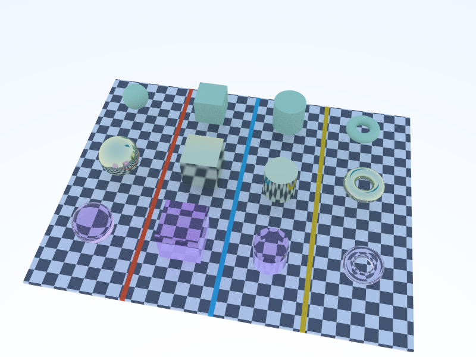

# Ray Tracing in One Weekend 학습 프로젝트

첫 학습 코드는 `examples/02_01_ppm/main.cc`에서 시작합니다. 책의 코드를 직접 입력할 수 있도록 해당 파일에는 구현을 넣어 두지 않았습니다.

각 학습 단계는 `examples/<예제 이름>/` 아래에 독립적으로 보존됩니다. 이후 책에서 만드는 헤더도 해당 예제 폴더에 함께 두므로, 나중에 다른 예제의 변경에 영향받지 않고 다시 빌드할 수 있습니다. 예제 이름에는 영문자, 숫자, 밑줄만 사용합니다.

- 온라인 책: <https://raytracing.github.io/books/RayTracingInOneWeekend.html>
- 공식 참고 저장소: <https://github.com/RayTracing/raytracing.github.io/>

## 학습 흐름

```sh
# 보존된 예제 목록
make list

# 이전 단계를 통째로 복사하여 다음 단계 시작
make new NAME=02_02_progress FROM=02_01_ppm

# 특정 예제 Debug 빌드
make build EXAMPLE=02_01_ppm

# 특정 예제 실행(표준출력이 터미널에 표시됨)
make run EXAMPLE=02_01_ppm

# 빌드 후 PPM 생성, 유효성 검사, PNG 변환
make render EXAMPLE=02_01_ppm

# 렌더 후 macOS 이미지 뷰어로 열기
make preview EXAMPLE=02_01_ppm

# 시간이 오래 걸리는 예제의 최적화 렌더
make render-release EXAMPLE=02_01_ppm
```

`EXAMPLE`을 생략하면 기본값은 `02_01_ppm`입니다. 결과는 예제별로 `output/<예제 이름>/image.ppm`과 `image.png`에 저장됩니다. 프로그램의 `std::cout`은 PPM 파일로, `std::clog`/`std::cerr`는 터미널로 분리되므로 책의 진행률 출력도 이미지 파일을 망가뜨리지 않습니다.

VS Code에서는 `Cmd+Shift+B`로 기본 예제를 Debug 빌드할 수 있습니다. Command Palette의 **Tasks: Run Task**에서 기본 예제의 렌더·미리보기·Release 렌더도 선택할 수 있습니다. 다른 예제는 위 명령에서 `EXAMPLE`만 바꾸면 됩니다.

C/C++ 파일은 저장할 때 자동으로 포맷됩니다. 프로젝트의 `.clang-format`은 책과 동일하게 들여쓰기 4칸과 최대 96자 너비를 사용하며, 책의 include 순서와 설명 주석은 임의로 재정렬하지 않습니다.

## 설치된 도구

- Apple Clang: C++ 컴파일러
- CMake + Ninja: Debug/Release 빌드
- LLDB: 디버거
- ImageMagick: PPM 검사 및 PNG 변환
- VS Code C/C++ + CMake Tools: 코드 완성, 오류 표시, 빌드 연동

---




## Release 탐색 실행 명령

아래 명령은 Release 빌드 후 탐색 창을 엽니다. 한 번에 원하는 명령 하나를 실행하세요.
`room_*`와 `progressive_viewer`는 `make render-release`에서 PPM/PNG 파일 대신
창을 표시합니다. 다른 예제는 기존 파일 출력 방식을 사용합니다.

### 기본 방 씬 4개 — NEE 켜짐

```sh
make render-release EXAMPLE=room_sphere
make render-release EXAMPLE=room_cube
make render-release EXAMPLE=room_cylinder
make render-release EXAMPLE=room_torus
```

### 변환 방 씬 4개 — NEE 켜짐

```sh
make render-release EXAMPLE=room_sphere_transformed
make render-release EXAMPLE=room_cube_transformed
make render-release EXAMPLE=room_cylinder_transformed
make render-release EXAMPLE=room_torus_transformed
```

변환 버전은 회전·비균일 스케일·위치 변화를 적용합니다.
변환 후 도형의 최저점을 계산해 바닥에 배치합니다.

### 방 씬별 NEE 끄기

```sh
make render-release EXAMPLE=room_sphere ARGS=--no-nee
make render-release EXAMPLE=room_cube ARGS=--no-nee
make render-release EXAMPLE=room_cylinder ARGS=--no-nee
make render-release EXAMPLE=room_torus ARGS=--no-nee

make render-release EXAMPLE=room_sphere_transformed ARGS=--no-nee
make render-release EXAMPLE=room_cube_transformed ARGS=--no-nee
make render-release EXAMPLE=room_cylinder_transformed ARGS=--no-nee
make render-release EXAMPLE=room_torus_transformed ARGS=--no-nee
```

### 방 씬 공통 옵션

| 옵션 | 동작 |
|---|---|
| 옵션 없음 | 400×400 탐색 창, NEE 켜짐 |
| `--preview` | 160×160으로 렌더링하는 탐색 창 |
| `--no-nee` | Lambertian 직접광 샘플링을 끄고 기존 산란으로 계산 |
| `--offline` | 창 없이 유한한 샘플 수를 계산하고 표준출력으로 PPM 출력 |

여러 옵션은 따옴표 안에 함께 적습니다. 모든 `room_*`에 적용할 수 있습니다.

```sh
# 저해상도로 탐색
make render-release EXAMPLE=room_sphere ARGS=--preview

# 저해상도 + NEE 끄기
make render-release EXAMPLE=room_torus_transformed ARGS="--preview --no-nee"
```

탐색 창은 정지 상태에서 계속 샘플을 누적합니다.
`--offline`에서만 기본 1024 spp, `--preview` 조합 시 256 spp로 종료합니다.
파일 저장은 빌드 출력이 PPM에 섞이지 않도록 빌드와 실행을 분리하세요.

```sh
make release EXAMPLE=room_sphere
mkdir -p output/room_sphere

# 400×400, 1024 spp, NEE 켜짐
./build/release/bin/room_sphere --offline > output/room_sphere/image.ppm
magick output/room_sphere/image.ppm output/room_sphere/image.png

# 160×160, 256 spp, NEE 꺼짐
./build/release/bin/room_sphere --offline --preview --no-nee > output/room_sphere/preview_no_nee.ppm
magick output/room_sphere/preview_no_nee.ppm output/room_sphere/preview_no_nee.png
```

### progressive_viewer — 야외 프리미티브 비교

```sh
# 기본 400×300 탐색 창
make render-release EXAMPLE=progressive_viewer

# 저해상도 320×240 탐색 창
make render-release EXAMPLE=progressive_viewer ARGS=--preview
```

현재 지원하는 실행 옵션은 `--preview`뿐이며, 첫 번째 인자로 전달합니다.
`--no-nee`, `--offline`은 이 예제에서 지원하지 않습니다.
등록된 사각 광원 없이 하늘빛을 사용하는 씬이므로 NEE 비교 대상도 아닙니다.
탐색 중에는 `samples_per_pixel` 설정과 무관하게 계속 누적합니다.
해상도·깊이·FOV는 `examples/progressive_viewer/main.cc`의 카메라 설정에서,
작업 스레드 수는 `common/viewer.h`의 `thread_pool pool(...)`에서 변경합니다.
이 값들을 바꾸는 명령행 옵션은 아직 없습니다.

### 공통 조작과 측정

| 키 | 동작 |
|---|---|
| W / S | 시선 방향 전진 / 후진 |
| A / D | 좌우 이동 |
| Q / E | 아래 / 위 이동 |
| 방향키 | 시선 회전 |
| Esc | 종료 |

카메라를 이동하면 누적 샘플과 측정 평균을 초기화하고, 멈추면 다시 누적합니다.
창 제목에 spp·직전 패스 시간·평균 패스 시간이 표시되며, 콘솔에는 50패스마다
누적 렌더링 시간이 출력됩니다. 이 시간은 화면 표시 시간을 제외한 렌더링 패스 시간입니다.

## 실내 발광 씬 구성과 NEE

각 방은 왼쪽 유리·중앙 무광·오른쪽 금속 오브젝트를 비교합니다.
왼쪽 벽은 빨강, 오른쪽 벽은 초록, 정면 벽과 천장은 흰색,
바닥은 단색 Lambertian입니다. 입구는 열려 있습니다.
씬 설정은 `common/room_scene.h`에 모았습니다.

천장 패널은 한쪽 면이 발광하는 사각형이며 하늘 배경은 꺼져 있습니다.
바닥·벽·무광 오브젝트의 Lambertian 재질에 NEE를 적용합니다.
금속·유리는 기존 산란을 사용하며, 디노이저는 없습니다.
광원을 등록하지 않은 기존 예제는 기존 동작과 하늘 배경을 유지합니다.

두 경우 모두 동일한 아래쪽 단면 발광 사각형을 사용합니다.
`quad_light.h`는 면적 균일 샘플링과 차폐 검사를 담당하고, `lambertian`이
`nee_albedo()`로 반사율을 제공합니다. 별도의 개선 재질 클래스는 없습니다. `camera.h`는 NEE 직후 등록 광원을 바로 맞힌
경로의 방출광만 제외하며, 다른 표면을 거친 경로는 유지합니다.
유리는 shadow ray를 차폐하지만 굴절 경로 자체는 기존 재귀로 추적합니다.
따라서 유리 아래 집광 무늬의 노이즈는 여전히 남을 수 있습니다.
NEE는 Lambertian 교점마다 shadow ray를 추가하므로 ms/pass보다 같은 시간에서의 노이즈를
기준으로 비교하세요. 비교 실행은 카메라·해상도·패스 수를 동일하게 맞춥니다.
